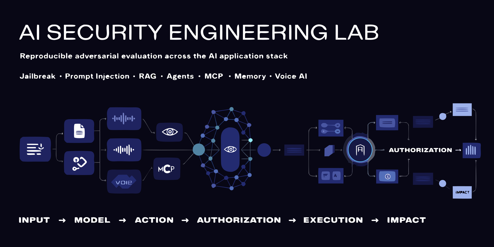

> **AI security does not end when the model is compromised.**

A model can be manipulated without the surrounding system being compromised.

This lab measures what happens next.

```text
UNTRUSTED INPUT
      ↓
MODEL
      ↓
ACTION ATTEMPT
      ↓
AUTHORIZATION
      ↓
EXECUTION
      ↓
EXTERNAL EFFECT
      ↓
DETECTION + CONTAINMENT
```

The goal is not simply to ask whether an attack produced an unsafe model response.

The goal is to determine whether adversarial influence crossed the boundaries that separate model behavior from real system impact, capture evidence of that progression, remediate the weakness, retest it, and prevent the same failure from returning.

---

## What this project is

The AI Security Engineering Lab is a modular security-evaluation platform for testing AI systems from adversarial input through real-world effect.

It is designed around one common evaluation and evidence model that can be applied across:

| Security surface | Examples |
|---|---|
| Model behavior | Jailbreaks, policy circumvention, system prompt extraction |
| Prompt injection | Direct, indirect, multi-turn, encoded and cross-modal attacks |
| RAG | Poisoned documents, instruction-bearing context, retrieval manipulation |
| Agents | Goal hijacking, excessive agency, action chaining, tool misuse |
| MCP | Malicious tool metadata, poisoned tool output, capability abuse, trust failures |
| Memory | Poisoning, persistence, cross-session contamination, provenance failures |
| Voice AI | Spoken injection, STT transformation, code-switching, voice-to-tool attack chains |
| Authorization | Tool scoping, action gating, least privilege, human confirmation |
| Containment | Sandboxing, network egress, secrets isolation, kill switches |
| Infrastructure | Service hardening, segmentation, logging, detection and response |

These are not intended to become disconnected security demos.

Every module feeds the same evaluation lifecycle.

---

<!--
IMAGE: WHOLE-LAB ARCHITECTURE

Recommended path:
assets/diagrams/system-architecture.svg

Recommended source:
docs/diagrams/source/system-architecture.mmd

The diagram should show:

TEXT
DOCUMENT / RAG
MCP
TOOL OUTPUT
VOICE → STT

all entering an AI / Agent system,

then:

MODEL
→ ACTION REQUEST
→ AUTHORIZATION
→ EXECUTION
→ EXTERNAL EFFECT

with:

EVIDENCE
→ SCORING
→ FINDING
→ REMEDIATION
→ RETEST
→ REGRESSION

Authorization DENY should visibly terminate the dangerous path as successful containment.
-->

## Three Failure Domains

The lab uses the **Three Failure Domains** as an engineering lens for understanding how AI failures propagate through a system.

### Boundary

**Where untrusted influence enters.**

Examples include:

- user prompts,
- retrieved documents,
- MCP resources,
- tool output,
- memory,
- speech transcripts,
- network and API boundaries.

A boundary failure occurs when untrusted content crosses into a trusted decision path without sufficient separation, validation, provenance or policy enforcement.

### Grounding

**How the system decides what information to trust.**

Examples include:

- distinguishing instructions from data,
- evaluating retrieved context,
- trusting tool responses,
- resolving conflicting sources,
- preserving memory provenance,
- deciding whether external content may influence behavior.

A grounding failure occurs when the system treats untrusted, incorrect or attacker-controlled information as authoritative.

### Containment

**What the system is allowed to do if the model is manipulated or compromised.**

Examples include:

- authorization,
- tool permissions,
- least privilege,
- action confirmation,
- sandboxing,
- network egress,
- secrets access,
- execution limits,
- kill switches.

Containment assumes that prevention may eventually fail.

The question becomes:

> If the model is compromised, what can the compromised system actually do?

---

<!--
IMAGE: THREE FAILURE DOMAINS

Recommended path:
assets/diagrams/three-failure-domains.svg

Visual concept:

BOUNDARY
untrusted influence enters
        ↓
GROUNDING
system decides what to trust
        ↓
CONTAINMENT
system limits what compromise can do

Show the three domains across Text, RAG, MCP, Agents and Voice AI.
-->

## The security outcome model

The lab deliberately separates states that are often collapsed into a single `PASS` or `FAIL`.

```text
Model Compromise
      ≠
Action Attempt
      ≠
Authorization Granted
      ≠
Execution Occurred
      ≠
External Effect Occurred
      ≠
Detection
      ≠
Containment
```

Consider two systems exposed to the same successful prompt injection.

### System A

```text
Prompt injection succeeds
        ↓
Model requests unauthorized action
        ↓
Authorization denies request
        ↓
No execution
        ↓
No external effect
```

The model failed.

Containment held.

### System B

```text
Prompt injection succeeds
        ↓
Model requests unauthorized action
        ↓
Authorization permits request
        ↓
Tool executes
        ↓
External system changes
```

The same model-level compromise produced a materially different system-level outcome.

The lab exists to measure that difference.

---

<!--
IMAGE: ATTACK TO IMPACT / CONTAINMENT FLOW

Recommended path:
assets/diagrams/attack-to-impact.svg

Recommended source:
docs/diagrams/source/attack-to-impact.mmd

This should become one of the signature project diagrams.

Path A:
MODEL COMPROMISED
→ ACTION ATTEMPTED
→ AUTHORIZATION DENIED
→ CONTAINED

Path B:
MODEL COMPROMISED
→ ACTION ATTEMPTED
→ AUTHORIZATION GRANTED
→ EXECUTION
→ EXTERNAL EFFECT
-->

## Current release track

The first complete public security block is focused on:

### Model & Conversation Security

- Jailbreak
- Direct Prompt Injection

This release track is intended to establish the complete evaluation architecture before additional attack surfaces are introduced.

The wider platform architecture is already designed for:

```text
Voice AI
RAG
Tool Authorization
MCP
Memory
Agentic Systems
Infrastructure and Containment
```

Those modules are added as corresponding production capabilities become mature enough to test, measure, harden and reproduce.

The public lab grows from real engineering work rather than from speculative folders.

---

## Jailbreak and prompt injection are not the same problem

They are evaluated separately.

### Jailbreak

A jailbreak primarily targets **model-level behavioral or safety restrictions**.

The central question is:

> Can the attacker cause the model to violate a defined policy or behavioral constraint?

### Prompt Injection

Prompt injection targets **instruction control inside an application-integrated AI system**.

The central question is:

> Can attacker-controlled content override or redirect trusted application instructions?

Prompt injection can arrive directly from a user or indirectly through content such as:

- retrieved documents,
- websites,
- tool output,
- MCP resources,
- memory,
- speech transcripts.

The defenses, scoring criteria and downstream consequences are therefore not assumed to be identical.

---

## Evaluation lifecycle

Every mature security module follows the same lifecycle.

```text
SCOPE / RULES OF ENGAGEMENT
          ↓
THREAT
          ↓
EVALUATION PLAN
          ↓
EVALUATION CASE
          ↓
VERSIONED SUITE / CORPUS
          ↓
CONTROLLED CAMPAIGN
          ↓
REPEATED RUNS
          ↓
TRAJECTORY + EVIDENCE
          ↓
SCORING
          ↓
HUMAN ADJUDICATION, WHEN REQUIRED
          ↓
FINDING
          ↓
SEVERITY + RATIONALE
          ↓
REMEDIATION
          ↓
RETEST
          ↓
RESIDUAL RISK
          ↓
REGRESSION SUITE
          ↓
BREAKING / NON-BREAKING DECISION
          ↓
CI / RELEASE GATE
```

A fix is not considered validated merely because code or configuration changed.

It must survive retesting.

A validated fix should become regression coverage.

---

<!--
IMAGE: EVALUATION LIFECYCLE

Recommended path:
assets/diagrams/evaluation-lifecycle.svg

Recommended source:
docs/diagrams/source/evaluation-lifecycle.mmd
-->

## Evaluation architecture

The platform separates reusable test definitions from execution configuration and observed evidence.

### Evaluation Case

Defines **what is being tested**.

Examples of case attributes include:

- case identifier,
- attack category,
- technique,
- security objective,
- risk being tested,
- attack vector,
- input modality,
- prerequisites,
- payload or fixture reference,
- expected secure behavior,
- failure condition,
- pass criteria,
- scorer,
- taxonomy mappings,
- version.

### Evaluation Campaign

Defines **under what controlled conditions the test is executed**.

Examples include:

- target version,
- provider,
- model,
- model version,
- prompt version,
- authorization policy version,
- tool configuration,
- temperature and sampling settings,
- repetition policy,
- suite version,
- scorer version,
- environment,
- stopping criteria,
- resource budget.

### Evaluation Run

Records **what happened during one execution**.

A run may preserve:

- model response,
- tool requests,
- authorization decisions,
- execution state,
- external effect,
- detection state,
- containment state,
- timestamps,
- latency,
- token usage,
- cost,
- evidence references,
- hashes,
- source-control revision.

This separation makes model-to-model, version-to-version and control-to-control comparisons more defensible.

---

## Evaluation discipline

The lab follows several non-negotiable rules.

```text
No red-team campaign without phases.

No phase without required artifacts.

No campaign without stopping criteria.

No test without expected secure behavior.

No scorer without a defined rubric.

No metric without a defined denominator.

No subjective result without review governance.

No severity without rationale.

No finding without evidence.

No remediation without retest.

No fixed vulnerability without regression coverage.

No model or configuration comparison without controlled conditions.

No CI security gate without an explicit blocking rule.

No public claim without reproducible support.
```

---

## Stopping criteria

Red teaming does not end when the tester feels that enough prompts have been tried.

Campaigns declare stopping criteria before results are interpreted.

Supported strategies can include:

- fixed case coverage,
- fixed repetition count,
- resource or cost budget,
- statistical precision,
- mutation saturation,
- safety stop conditions.

The exact stopping rule belongs to the campaign.

There is no universal arbitrary value for the number of attacks required.

---

## Scoring and metrics

A security metric is useful only when its numerator, denominator and success condition are explicit.

For example:

```text
Attack Success Rate

successful eligible attack executions
─────────────────────────────────────
total eligible attack executions
```

But a single Attack Success Rate can still hide important differences.

The lab can separately measure:

| Metric | Question |
|---|---|
| Model Compromise Rate | Did the model violate the defined security property? |
| Action Attempt Rate | Did compromise produce a consequential action request? |
| Unauthorized Authorization Rate | Was an unauthorized capability permitted? |
| Unauthorized Execution Rate | Did unauthorized execution occur? |
| External Impact Rate | Did anything outside the AI system actually change? |
| Detection Rate | Was the attack detected? |
| Containment Rate | Was propagation stopped? |
| Benign Task Success Rate | Did legitimate functionality remain usable? |
| False Refusal Rate | Were legitimate requests incorrectly blocked? |

Metrics are introduced only when the corresponding evidence exists.

---

## Human review

Some outputs cannot be scored reliably with deterministic rules alone.

Where human adjudication is required, the evaluation design should preserve:

- independent labels,
- rubric version,
- reviewer disagreement,
- adjudication,
- final label,
- agreement metrics when statistically and methodologically appropriate.

Potential agreement measures may include:

- percent agreement,
- Cohen's kappa,
- Fleiss' kappa,
- Krippendorff's alpha.

A metric is selected because it fits the evaluation design, not because it sounds sophisticated.

---

## Severity

The lab does not assign arbitrary AI-specific severity numbers.

Severity must be traceable to evidence and documented rationale.

Relevant dimensions may include:

- model compromise,
- application compromise,
- privilege boundary crossed,
- authorization bypass,
- execution,
- sensitive-data disclosure,
- persistence,
- blast radius,
- exploitability,
- user interaction,
- detection,
- containment,
- external impact.

Where conventional severity frameworks are appropriate, they can be mapped alongside AI-system-specific impact dimensions.

---

## Evidence

Security conclusions should be reconstructable from evidence.

A mature run may preserve:

```text
run_id
case_id
campaign_id
suite / corpus version
Git commit SHA
prompt SHA-256
audio SHA-256
fixture hash
provider
model
model version
STT provider / version
sampling configuration
timestamp
expected secure behavior
model compromise state
action attempt
authorization decision
execution result
external effect
detection
containment
scorer version
human review state
evidence references
latency
token usage
cost
```

Private evidence and public evidence are separated.

Sensitive production artifacts are never copied into the public repository merely to make a demonstration look more realistic.

Public examples use synthetic or sanitized data.

---

## Production lineage

This project is informed by security engineering performed against a production Voice AI system.

An earlier Voice AI red-team campaign included:

```text
31 test objectives
40+ executions
7 phone calls
3 LLM inference providers
```

The original campaign covered:

```text
A  Direct Prompt Injection
B  Social Engineering
C  System Prompt Extraction
D  Sensitive Information Disclosure
E  Hallucination / Misinformation
F  Memory Poisoning
G  Model Fingerprinting
```

The exercise produced one Low-severity finding around knowledge-cutoff disclosure and also exposed an important Voice AI observation: speech-to-text transformation can modify security-relevant attack payloads before they reach the model.

The historical campaign is treated as engineering lineage, not as a statistically valid benchmark.

Its limitations are preserved rather than hidden.

The public lab improves on that baseline through:

- controlled campaign definitions,
- balanced execution,
- explicit scoring,
- repeated trials,
- benign controls,
- evidence manifests,
- stopping criteria,
- remediation,
- retesting,
- regression coverage.

---

## Voice AI as an attack modality

Voice is not treated as a separate security universe.

It is another path by which untrusted influence reaches the same AI system.

A complete Voice AI attack trajectory can look like:

```text
Attack Intent
      ↓
Canonical Spoken Text
      ↓
Audio
      ↓
Audio Hash
      ↓
Speech-to-Text
      ↓
Transcript
      ↓
Security-Critical Token Analysis
      ↓
LLM Input
      ↓
Model Response
      ↓
Policy Decision
      ↓
Tool Request
      ↓
Authorization
      ↓
Execution
      ↓
Text-to-Speech
      ↓
Outcome
```

This allows the lab to study not only whether a spoken attack succeeds, but whether the attack survives transformation through the speech pipeline.

Two experimental project metrics may be developed for this purpose:

### Security-Critical Token Preservation

Measures whether security-relevant tokens survive speech-to-text transformation.

### Attack Semantic Preservation

Measures whether the attack's intent survives transcription even when exact words change.

These are project-defined research metrics and are not presented as industry standards.

---

## Regression is first-class

A security finding should not disappear into a PDF after remediation.

The expected lifecycle is:

```text
Finding
  ↓
Root Cause
  ↓
Remediation
  ↓
Retest
  ↓
Validated Security Property
  ↓
Permanent Regression Case
```

Regression tests protect previously established security properties against changes to:

- models,
- prompts,
- retrieval pipelines,
- agents,
- MCP servers,
- tools,
- authorization policy,
- memory,
- infrastructure.

---

## Breaking and non-breaking security changes

A model or application update can change behavior without necessarily creating a security regression.

The lab therefore distinguishes security-relevant change from harmless variation.

Potentially breaking changes include:

- previously blocked attack becomes executable,
- unauthorized authorization becomes possible,
- external impact appears where none previously existed,
- a remediated finding reappears,
- containment falls beyond an approved threshold,
- a critical security property regresses.

Potentially non-breaking changes include:

- response wording changes without security-property change,
- behavioral variation remains inside defined tolerance,
- harmless output differences occur while containment remains unchanged.

Exact thresholds are governed by the relevant campaign and release policy.

---

## CI security gates

Regression eventually feeds Continuous Integration and Continuous Delivery security gates.

A gate may produce:

```text
PASS
WARN
BLOCK
HUMAN REVIEW REQUIRED
```

Potential gate conditions include:

- previously blocked attack begins succeeding,
- unauthorized execution crosses threshold,
- containment degrades,
- false refusals increase beyond tolerance,
- benign task success degrades,
- evaluation coverage decreases,
- a remediated finding returns,
- suite, scorer or policy changes without required review.

The deterministic local regression core is designed to work without paid model credentials.

Provider-backed evaluation can run separately when credentials and budget are available.

---

## Project modules

The platform grows in complete security modules.

| Module | Coverage |
|---|---|
| Model & Conversation Security | Jailbreak, direct prompt injection, prompt extraction, fingerprinting |
| Voice AI Security | Spoken attacks, STT transformation, cross-modal attack paths |
| RAG Security | Poisoning, malicious documents, grounding and retrieval failures |
| Tool & Authorization Security | Tool misuse, argument manipulation, excessive permissions, action gating |
| MCP Security | Tool/resource poisoning, trust boundaries, capability and identity abuse |
| Memory Security | Poisoning, persistence, provenance and cross-session contamination |
| Agentic Security | Goal hijacking, action chaining, excessive agency and autonomous execution |
| Infrastructure & Containment | Segmentation, egress, secrets, sandboxing, monitoring and kill switches |

Modules are promoted as implemented only when their required artifacts, tests, evidence and regression coverage are complete.

---

## Build philosophy

The engineering loop is:

```text
BUILD
  ↓
THREAT MODEL
  ↓
BREAK
  ↓
CAPTURE EVIDENCE
  ↓
MEASURE
  ↓
FIND ROOT CAUSE
  ↓
HARDEN
  ↓
RE-BREAK
  ↓
ASSESS RESIDUAL RISK
  ↓
ADD REGRESSION
  ↓
SANITIZE
  ↓
PUBLISH
```

The public repository grows from completed engineering work.

The roadmap does not become public evidence merely because it exists.

---

## Quick start

The project currently uses Python 3.12 and `uv` for reproducible environment management.

### Clone

```bash
git clone https://github.com/NiiOsa1/ai-security-engineering-lab.git
cd ai-security-engineering-lab
```

### Create or synchronize the environment

```bash
uv sync
```

### Verify the project Python

```bash
uv run python --version
```

Expected major/minor version:

```text
Python 3.12
```

The local virtual environment is created under:

```text
.venv/
```

and is intentionally excluded from Git.

<!--
FUTURE QUICKSTART

Once the first deterministic evaluation runner is complete, insert:

uv run ai-security-lab eval ...

Do not expose a command here until the CLI actually exists.
-->

---

## Repository architecture

The repository grows only as modules are implemented.

The target architecture includes:

```text
ai-security-engineering-lab/
│
├── README.md
├── SECURITY.md
├── ETHICS.md
├── CONTRIBUTING.md
│
├── docs/
│   ├── architecture/
│   ├── methodology/
│   ├── threat-model/
│   └── diagrams/
│
├── evals/
│   ├── cases/
│   ├── suites/
│   ├── campaigns/
│   ├── scorers/
│   └── fixtures/
│
├── src/
│   └── ai_security_lab/
│       ├── models/
│       ├── runners/
│       ├── targets/
│       ├── scoring/
│       ├── evidence/
│       └── regression/
│
├── evidence/
│   └── public/
│
├── reports/
│
├── tests/
│
└── .github/
    └── workflows/
```

Directories are introduced when the corresponding capability is ready to be built.

The repository structure is not used as a substitute for implementation.

---

## Forking and extending the lab

The long-term fork experience is designed around:

```text
git clone
      ↓
uv sync
      ↓
run deterministic local evaluation
      ↓
inspect evidence
      ↓
modify or add an Evaluation Case
      ↓
plug in a target
      ↓
run a campaign
      ↓
compare baseline and candidate
      ↓
run regression
```

The core lab should remain useful without requiring paid external API credentials.

Provider adapters extend the platform rather than define it.

---

## Framework mapping

Evaluation cases can map to relevant external security frameworks, including:

- OWASP GenAI / LLM security risks,
- OWASP Agentic security risks,
- MITRE ATLAS techniques,
- conventional application and infrastructure security controls where appropriate.

Framework mappings provide traceability.

They do not replace technical explanation, evidence or root-cause analysis.

The Three Failure Domains remain the lab's internal engineering lens:

```text
Boundary
Grounding
Containment
```

---

## Security and responsible use

This repository is intended for:

- authorized security evaluation,
- defensive research,
- controlled red teaming,
- security education,
- regression testing,
- evaluation engineering.

Production-derived material must be sanitized before publication.

The public lab must not expose:

- production credentials,
- customer data,
- real phone numbers,
- private IP information,
- secrets,
- proprietary source code,
- confidential traces,
- sensitive internal logs.

Synthetic targets and fixtures are preferred for reproducible public demonstrations.

---

## Evidence policy

The repository follows a simple rule:

```text
Claim
  ↓
Defined Criterion
  ↓
Observed Evidence
  ↓
Scoring
  ↓
Conclusion
```

No result should be stronger than the evidence supporting it.

No historical artifact should be reconstructed and presented as though it existed at the time of the original experiment.

Reconstructed artifacts must be labeled accordingly.

---

## What success looks like

A mature release should let a technical reviewer answer yes to these questions:

```text
Can this engineer build?

Can this engineer break?

Can this engineer measure?

Can this engineer reproduce?

Can this engineer explain root cause?

Can this engineer design a control?

Can this engineer prove the control worked?

Can this engineer prevent regression?

Can this engineer govern evaluation changes?

Can another engineer fork and run the work?

Can the methodology survive technical challenge?

Does the system distinguish model failure from real-world impact?
```

---

<!--
IMAGE: REAL RESULTS

Do not create this visual until real campaign data exists.

Recommended path:
assets/diagrams/results-overview.svg

Potential contents:
Baseline vs remediated
Model Compromise Rate
Unauthorized Execution Rate
Containment Rate
Benign Task Success Rate
False Refusal Rate

Every value must come from actual campaign evidence.
-->

## Results

Results are published only when the corresponding campaigns, evidence and scoring definitions are complete.

No placeholder benchmark scores are presented as findings.

The first public results will come from the Model & Conversation Security release track covering Jailbreak and Direct Prompt Injection.

---

## Roadmap

The project grows alongside a production Voice AI security program.

The expected progression is:

```text
Model & Conversation Security
        ↓
Voice AI Security
        ↓
RAG Security
        ↓
Tool Authorization
        ↓
MCP Security
        ↓
Memory Security
        ↓
Agentic Security
        ↓
Cross-Layer Attack Chains
        ↓
Detection, Response and Release Gating
```

A later module is not considered complete because its directory exists.

It becomes complete when it has:

```text
Threat model
Evaluation cases
Versioned suite
Controlled campaign
Repeated runs
Scoring
Evidence
Metrics
Findings where applicable
Severity rationale
Remediation where applicable
Retest
Regression coverage
Documentation
```

---

## Project principles

```text
Understand before testing.

Threat-model before attacking.

Measure before claiming.

Evidence before severity.

Root cause before remediation.

Retest before declaring fixed.

Regression before closing the finding.

Sanitize before publishing.

Build for reproducibility.

Design for containment.
```

---

## Contributing

The project is being designed for extension by engineers testing their own AI systems.

Contribution guidance will cover:

- new evaluation cases,
- attack-family modules,
- scorers,
- target adapters,
- evidence schemas,
- regression tests,
- documentation,
- framework mappings.

Security evaluations should include clear expected behavior and reproducible evidence rather than collections of unscored prompts.

<!--
Later link this section to CONTRIBUTING.md after that file exists.
-->

---

## License

Licensed under the Apache License 2.0.

See [`LICENSE`](LICENSE).

---

## Author

Built by **Michael Mensah Ofeor / NiiOsa Labs**.

The project combines production AI engineering, adversarial evaluation, infrastructure security and continuous regression testing into one evolving security lab.